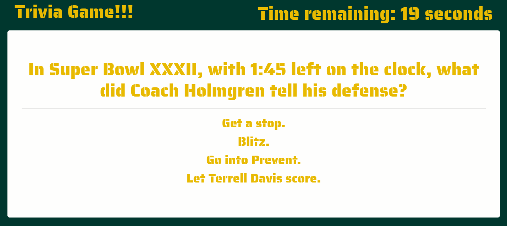

# Green Bay Packers Trivia 
___

___
# Summary
A Green Bay Packer themed JavaScript assignment using logic and jQuery to manipulate HTML.
___
# Playing the Game
### A trivia game that shows only one question until the player answers it or their time runs out.

___
### If the player selects the correct answer, a screen congratulates them for choosing the right option. After a few seconds, the next question is displayed.

___
### If the player selects the wrong answer, a screen chastises them for choosing the wrong option. After a few seconds, the next question is displayed.

___
### On the final screen, the player is shown the number of correct answers, incorrect answers, and unanswered questions along with an option to restart the game.
<!--  -->

___
### Hosted on [Github Pages](https://armonkahil.github.io/TriviaGame/).

### Packer fans click [here](https://www.youtube.com/embed/232NWVGHRQI?start=47&autoplay=1).

### [Full Disclosure: I'm a Bears fan](https://www.chicagobears.com).
